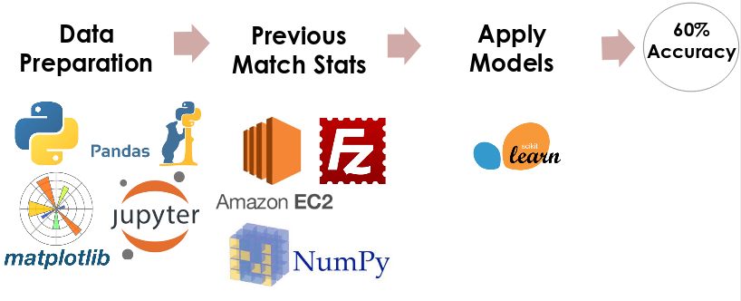
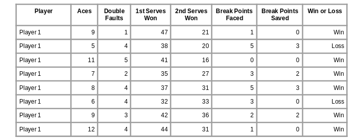
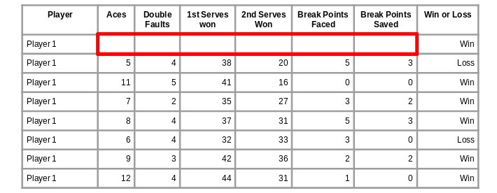
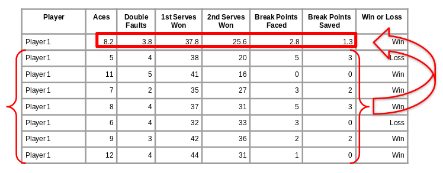
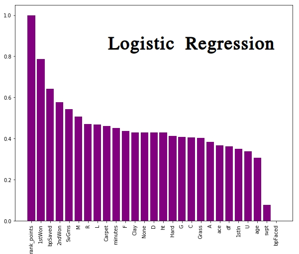
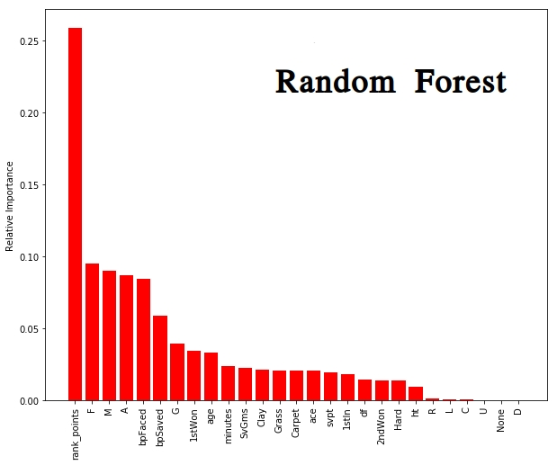

# Men's Tennis Predictions

Do you know the feeling when your favorite team or player loses a game they were supposed to win?  As a sports fan, I have experienced that dejection, especially potently in the elimination stages at the end of a season or tournament. What determines how well one can predict outcomes in sports competitions? One can start to answer this question with an example case, in the present case with men's tennis matches. This project predicts player win probabilities in men's professional tennis singles match on the ATP Tour.

The following sections provide details of the work. Additionally, a narrated summary of this project appears in this [video](https://youtu.be/ao2_MfWDg1g).

Note: This work originated as a Capstone project for the Data Science Immersive curriculum at Galvanize in August 2018. The efforts are continuing.

# Background
There have been several models developed for this purpose in the past. The [review](http://vuir.vu.edu.au/34652/1/jqas-2015-0059.pdf) by Kovalchik (2016) has an excellent comparison and discussion of the models. Some have used regression ('logit' or 'probit') methods, whereas others have predicted winners based on point-by-point outcome probabilities.  The methods result in accuracy values of 0.6 to 0.7. One of the best methods comes from FiveThirtyEight, resulting in an accuracy of 0.7 (70%).  This method uses a pair comparison model, based on Elo Ratings.  [Elo Ratings](https://en.wikipedia.org/wiki/Elo_rating_system), invented by physics professor Arpad Elo, were first used in chess rankings in 1960. For reference, a bookmakers' consensus model (based on averaging predictions made by human experts) yields an accuracy of 72%.

The biggest economic impact of accurate predictions is contributing to gambling and betting lines.  As suggested by Kovalchik (2016), it also could be useful for sports analysts and coaches. Both may gain insight into what makes one player more probable to win than another, where coaches may be able to use that information to benefit a player.

# Procedures followed

The project uses data gathered by Jeff Sackmann at [Tennis Abstract](http://www.tennisabstract.com/). It was available on GitHub in the [tennis_atp repo](https://github.com/JeffSackmann/tennis_atp).  Each row of data is for a particular match and each column contains the factors (features) of the match.  For data from 1992 through 2017, a larger set of features are available. (Data is also available for 2018, but this data was not used because the tournaments for that year were not complete at the time of the project.)

The features are of three types:
* Tournament features: Tournament ID, Date, Playing Surface, etc.
* Players features: Height, Age, Handedness
* Match features: Aces, Double Faults, etc.

An overview of the process is shown in Figure 1.  The data was prepared using the standard Python stack (numpy, pandas, etc.) to remove or fill missing values and to select features. Then, the match data is generated from previous player matches. (More detail on this appear later in this section.) Finally, Logistic Regression, Random Forest, and Gradient Boosted Trees all resulted in 60% accuracy.

 
  <b>Figure 1:</b> Machine Learning Workflow and Tools

A flavor of the data cleaning required is as follows: 
For missing player rank (2.4% of cases), the ranking was filled first with their average ranking over the data used and second with the worst (largest) ranking observed. The second is done because if a player ranking is not available due to the ranking being too poor (large number) to be recorded.

Two challenges in this gathered data are as follows:
1. Each row contains both the winner and the loser, and so does not associate well with a single target.
2. Rows contain _match features_ about the match itself, which **would not** be available for the sake of predicting the match.

For the first issue, data needs separated into data for the winner and data for the loser.  For the second issue, the _match features_ are considered important to making a more accurate prediction. Thus, a method to populate these features is required.

### Feature engineering

_Feature engineering_ refers to the process of modifying the feature space (adding, removing, or transforming features) for the purpose of making them more predictive.  Feature engineering for the two steps mentioned above were accomplished using the following procedures.

The dataset was first partitioned into two sets, one for the winner and one for the loser. The feature names (i.e. column labels) were then matched when appropriate (e.g. "Winner Aces" and "Loser Aces" to "Aces").  A new column is added, with label "1" ascribed to the winner data and "0" ascribed to the loser data.  The next step is concatenating the two resultant datasets to make one large dataframe. This accomplishes the first step needed: each row is associated with a unique target. This step has the effect of doubling the number of rows ('observations') while condensing the number of features.

The second step involves generating the statistics of interest for a particular match.  Since one only has access to _past_ data, some form of data from _previous matches_ is needed. In the project, data for any match were generated for the **players in the match** from the past _one year_ of matches that the player played. This was done using rolling average in pandas, with the _.rolling()_ DataFrame method.  The process is illustrated in Figures 2-4.

Figure 2 shows an example of how the data is prepared for analysis. For a particular player, the data from a certain time period are gathered together. Note that in Figure 2, the data are in _reverse_ chronological order.  Elements of the tournament features, player features, and match features are all used in this process, although Figure 2 illustrates the match features specifically. 

 
  <b>Figure 2:</b> Data Grouped by Player

The next step is removing the data associated with the particular match in question, here the first row.  This is illustrated in Figure 3. Since we cannot use the features from a match to predict the outcome of the _same match_, the blank space highlighted in the red box requires  some kind of agglomeration of previous match values.

 
  <b>Figure 3:</b> Eliminate Data Inaccessible <i>a priori</i>

This process is completed in Figure 4.  The values populating the first row are the average (mean) values from the remaining and are now associated with the target ("Win or Loss" column) in the first row. The process illustrated in Figures 2-4 is repeated for each observation in the data, namely replacing match features for each player in each match with data from that player's previous year of matches.

 
  <b>Figure 4:</b> Generate New Feature Values Based on Previous Player Data

This association of the engineered features with the target is used to train the models.  The features of the _test_ data (separate set from the _training_ data) are also similarly engineered in order to predict the target (Win or Loss).

### Models Used

The models used were Logistic Regression, Random Forests, and Gradient Boosted trees.  Logistic Regression was chosen for its similarity to model used in previous work, while allowing for different features to have prominence in the present project. Tree-based methods (Random Forest, Gradient Boosted Trees) were used since they often provide good performance and seemed to be underutilized in previous tennis predictions.
  
To make as direct a comparison between the models as possible, the same features were used in the analysis. The list of features used is as follows:

>Tournament Features:
* Surface: one-hot encoded for 'Carpet','Clay', 'Hard', 'Grass', 'None'
* Tournament Level: one-hot encoded for 'A'(lowest level), 'C' (mid level), 'M' (masters level),'G' (Grand Slam level), 'F' (end-of-year finals),  'D' (Davis Cup)
>Player Features:
* age: player age
* hand: one-hot encoded for 'L' (left),'R' (right), and 'U' (unknown)
* ht: player height
* rank_points: accrued points for all matches played, used for ordinal ranking 

>Match Features:
* 1stIn: Number of first serves not out when serving
* 1stWon: Number of points won on first serve when serving
* 2ndWon: Number of point won on second serve when serving
* SvGms: Number of service games
* svpt: Number of service points
* ace: number of aces
* bpFaced: number of break points faced when serving
* bpSaved: number of break points saved when serving
* df: double faults committed when serving
* minutes: how long a match lasts

# Results and Discussion

As mentioned earlier, all models used resulted in an accuracy value of 0.6 (or 60%).  All three models are within 1% of this value. Accuracy is an acceptable metric since this is an eminently balanced-class problem: For every winner, there is a loser, known as a 'zero-sum game'.

It is interesting that all three models considered here yielded very similar accuracy using the same features. For the two tree-based methods, the hyper-parameters were tuned.  It is likely that the Random Forest model is nearly optimally tuned, but the Gradient Boosted Tree models may benefit from additional tuning.  However further efforts would likely best be spent on feature selection or on more feature engineering.

## Insights

One can gather insights about what features are more predictive for the outcome of a match from the models used. Here, only the Logistic Regression and Random Forest are considered since all models resulted in very similar value of accuracy.

Figure 5 shows the normalized values of the Logistic Regression coefficients.  The normalization occurs in two steps.
* First, the features are scaled before applying the Logistic Regression
* Second, the resultant coefficients are normalized to the coefficient with the largest magnitude.
The most important features are shown toward the left side of Figure 5. In Logistic Regression, the single-most important features is the rank_points (a measure of the player's relative rank). This matches findings from previous works (Kovalchik, 2016). Additionally, other important variables were based on winning points, either as a measure of consistency (1stWon, 2ndWon) or performance in high-value situations (bpSaved). Unexpectedly, the surface ('Carpet', 'Clay', 'Hard', 'Grass', 'None') had relatively lesser influence, all falling in the broad swath of relatively equally influential coefficients.

 
  <b>Figure 5:</b> Logistic Regression Coefficients For Normalized Model Features

Figure 6 shows the feature importance from the Random Forest model. Again, the most important feature is rank_points. One interesting factor that appear important for the Random Forest model is the Tournament Level.  The values 'F', 'M', and 'A' are high in importance and refer to more prestigious tournaments (especially 'F', but also 'M') or the least prestigious tournaments ('A'). It appears that the type of tournaments a player participates in has predictive value. Another way that the Random Forest model validates the Logistic Regression coefficients is that the playing surface is relatively less important. The instances of surface ('Carpet', 'Clay', 'Hard', 'Grass', 'None') appear toward the tail end (right side of Figure 6) of the feature importance parameters.

 
  <b>Figure 6:</b> Feature Importance from Random Forest Model

# Further Investigation 

Several avenues for further investigation exist:
1. Considering a simpler model, so that there is no need for computing statistics from previous matches.
2. Using clustering to group players to determine a style and utilize these groups to make better predictions.
	* First, gather player statistics (such as aces, service speed, service efficiency, return efficiency, 1st serve percentage, etc.) 
	* Next, applying clustering to these features to get ~5 groups of player styles.
	* Finally, include the cluster a player belongs to as a feature in the original dataset  
3. Distributing the statistics over the surfaces (e.g. aces on grass) because I want to explore further if surface is a major predictor.

# Reference Cited :
Kovalchik, Stephanie Ann. ["Searching for the GOAT of tennis win prediction"](http://vuir.vu.edu.au/34652/1/jqas-2015-0059.pdf) _Journal of Quantitative Analysis in Sports_. 12(3): 127–138 (2016). 
Wikipedia contributors, ["Elo rating system"](https://en.wikipedia.org/wiki/Elo_rating_system) _Wikipedia, The Free Encyclopedia_. https://en.wikipedia.org/w/index.php?title=Elo_rating_system&oldid=856785064 (accessed 15 Aug 2018). 
Sackmann, Jeff. [tennis_atp Repository](https://github.com/JeffSackmann/tennis_atp) _GitHub, Inc_. https://github.com/JeffSackmann/tennis_atp (accessed 6 Aug 2018).
